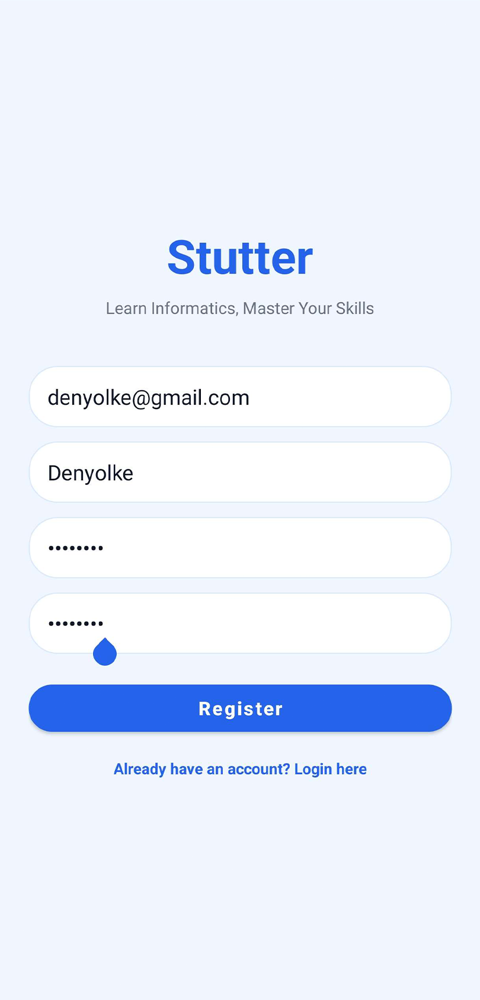
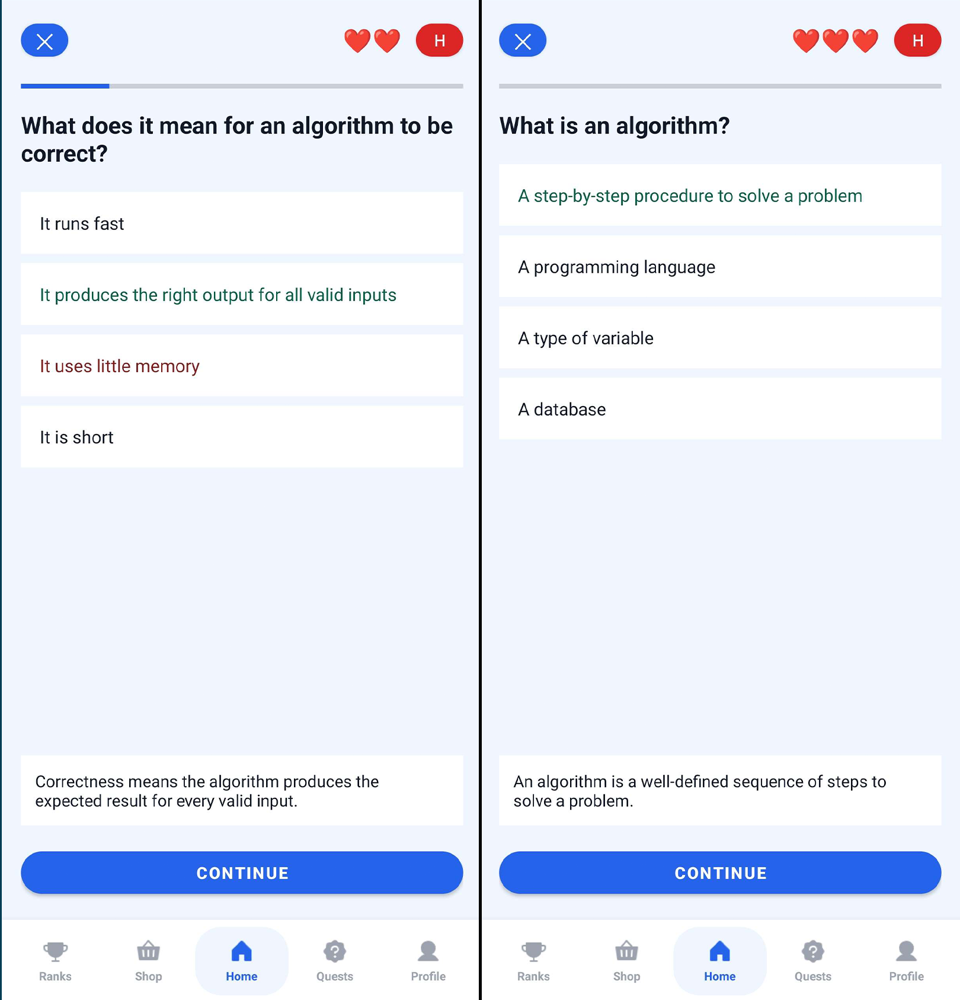
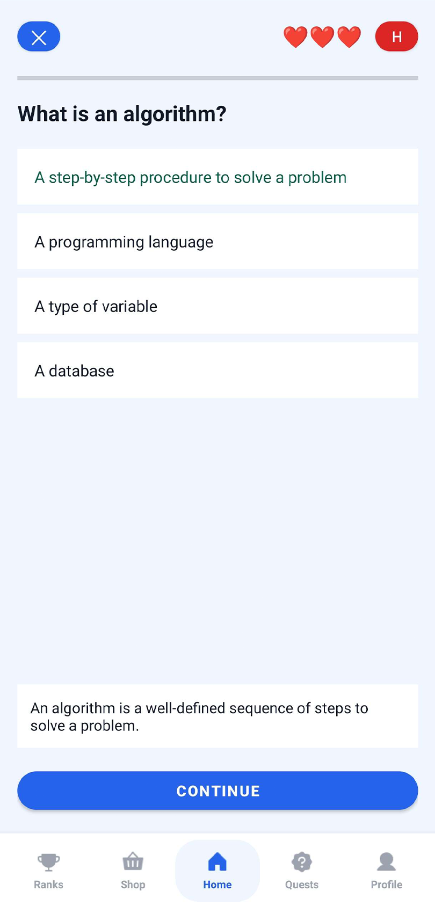
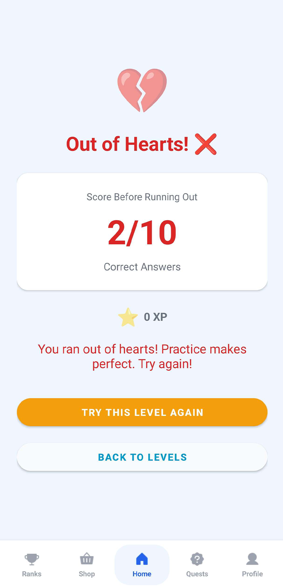
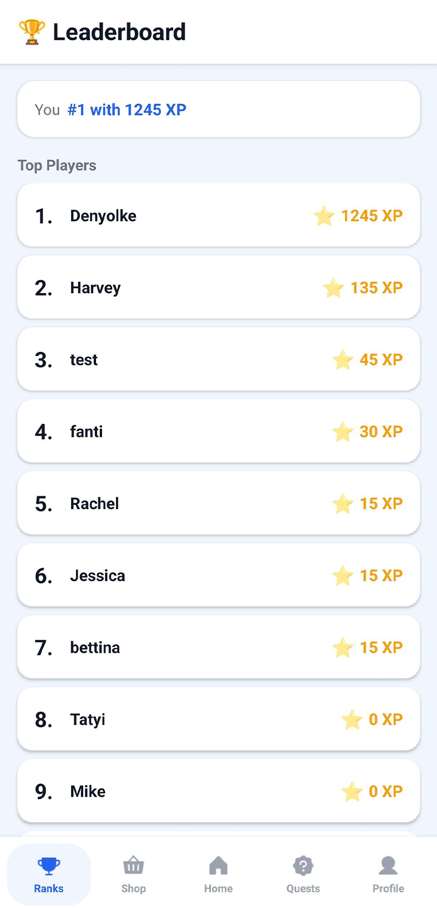

# 📱 Stutter – Learn Informatics, Master Your Skills

Stutter je Android mobilná aplikácia na učenie informatiky formou kvízov s gamifikačnými prvkami. Aplikácia umožňuje používateľom prechádzať témami, plniť úrovne a zbierať body XP na leaderboarde.

---

## 🚀 Funkcie

- 🔐 **Autentifikácia** – registrácia a prihlásenie cez Firebase Authentication
- 🏠 **Domovská obrazovka** – prehľad tém s pokrokom a štatistikami (XP, streak)
- 📚 **Témy a úrovne** – 5 tém (Dátové štruktúry, Algoritmy, OOP, Databázy, Web), každá s 10 úrovňami
- ❓ **Kvízy** – 10 otázok na úroveň so systémom sŕdc (životy)
- 🏆 **Leaderboard** – rebríček top 10 hráčov podľa XP
- 👤 **Profil** – zobrazenie štatistík, výber profilovej fotky, odhlásenie
- 💾 **Firebase Firestore** – ukladanie pokroku, XP a streaku

---

## 🏗️ Architektúra

```
com.example.stutter
├── AuthActivity.java              # Prihlasovanie / registrácia
├── MainActivity.java              # Hlavná aktivita s bottom navigáciou
├── firebase/
│   └── FirebaseAuthManager.java   # Firebase Auth + Firestore operácie
├── model/
│   ├── Question.java              # Model otázky
│   ├── Level.java                 # Model úrovne
│   ├── Topic.java                 # Model témy
│   └── UserProfile.java           # Model používateľského profilu
├── data/
│   └── MockRepository.java        # Lokálna databáza otázok (5×10 úrovní)
├── ui/
│   ├── AppViewModel.java          # ViewModel so zdieľaným stavom
│   ├── HomeFragment.java          # Domovská obrazovka
│   ├── LevelSelectionFragment.java# Výber úrovne
│   ├── QuizFragment.java          # Priebeh kvízu
│   ├── QuizCompletionFragment.java# Výsledok po dokončení kvízu
│   ├── GameOverFragment.java      # Game over obrazovka
│   ├── LeaderboardFragment.java   # Rebríček
│   ├── ProfileFragment.java       # Profil používateľa
│   └── adapter/
│       ├── TopicsAdapter.java     # Adaptér tém
│       ├── LevelAdapter.java      # Adaptér úrovní
│       ├── OptionsAdapter.java    # Adaptér možností v kvíze
│       └── LeaderboardAdapter.java# Adaptér leaderboardu
```

---

## 🧠 Herná mechanika

### Témy a úrovne
- 5 tém, každá obsahuje 10 úrovní
- Úrovne sú odomykané postupne – každú ďalšiu odomkne dokončenie predchádzajúcej
- Každá úroveň prináša **+15 XP** pri úspešnom dokončení

### Kvíz
- 10 otázok s 4 možnosťami odpovede
- Hráč začína s **3 srdciami** (životy)
- Nesprávna odpoveď = strata srdca
- Minuť všetky srdcia = **Game Over**, XP sa nezapočíta
- Dokončenie bez straty sŕdc = XP odmena + uloženie pokroku

### Streak systém
| Aktivita | Výsledok |
|----------|----------|
| Aktivita dnes (menej ako 24h) | Streak ostáva rovnaký |
| Aktivita včera (24–48h) | Streak +1 |
| Dlhšia pauza (nad 48h) | Streak sa resetuje na 1 |

---

## 🛠️ Technológie

| Technológia | Použitie |
|-------------|----------|
| **Java** | Hlavný programovací jazyk |
| **Android SDK** | Mobilná platforma |
| **Firebase Authentication** | Správa používateľov |
| **Firebase Firestore** | Cloudová databáza |
| **ViewModel + LiveData** | Správa stavu UI |
| **RecyclerView** | Zoznamy tém, úrovní, leaderboard |
| **Material Design** | UI komponenty |
| **ConstraintLayout** | Rozloženie obrazoviek |

---

## 📦 Nastavenie projektu

### Požiadavky
- Android Studio (Hedgehog alebo novší)
- Android SDK 26+
- Firebase projekt s aktívnym Authentication a Firestore

### Inštalácia

1. Klonuj repozitár:
   ```bash
   git clone https://github.com/tvoj-username/stutter.git
   ```

2. Otvor projekt v Android Studio.

3. Pridaj súbor `google-services.json` do priečinka `app/` (stiahni z Firebase konzoly).

4. V Firebase konzole povoľ:
   - **Authentication** → Email/Password
   - **Firestore Database**

5. Spusti aplikáciu na emulátore alebo fyzickom zariadení.

---

## 🗄️ Firestore dátová štruktúra

```
users/
  {userId}/
    username: String
    email: String
    totalXP: Number
    streak: Number
    completedLessons: Number
    lastActivityDate: Timestamp
    pfp: Number (1–6)

    topicProgress/
      {topicId}/
        completedLessons: Number
        completed: Boolean
```

---

## 📸 Obrazovky

### Registrácia


### Kvízový systém


### Výsledok kvízu


### Game Over


### Leaderboard


---

## 📝 Obsah kvízov

Momentálne obsahuje plnú sadu otázok pre tému **Dátové štruktúry** (10 úrovní × 10 otázok):

1. Základy dátových štruktúr
2. Polia (Arrays)
3. Spojové zoznamy (Linked Lists)
4. Zásobníky (Stacks)
5. Fronty (Queues)
6. Stromy (Trees)
7. Binárne vyhľadávacie stromy (BST)
8. Haldy (Heaps)
9. Grafy (Graphs)
10. Pokročilé opakovanie

Ostatné témy (Algoritmy, OOP, Databázy, Web) sú pripravené na doplnenie otázok.

---

## 👨‍💻 Autor

Projekt vytvorený ako školská práca zameraná na gamifikované učenie informatiky.

---

## 📄 Licencia

```
MIT License

Copyright (c) 2026 Dánl Tátyi

SOFTWARE.
```
